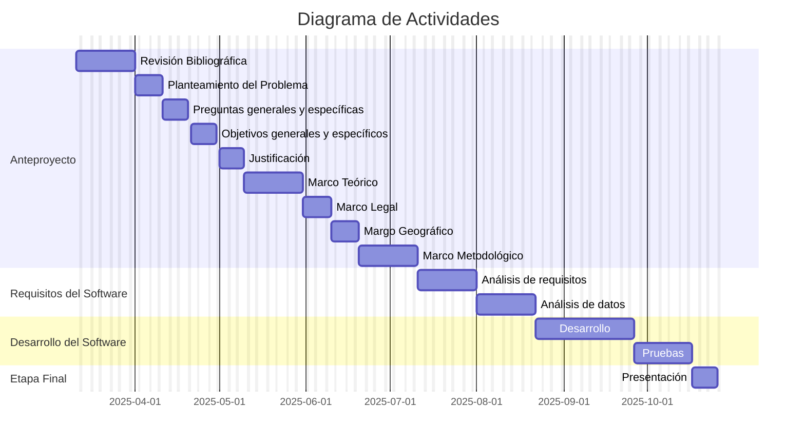

# DREAMINK

## Diagrama de Gantt

```mermaid
gantt
    title Diagrama de Actividades
    dateFormat YYYY-MM-DD
    excludes sunday wednesday
    section Anteproyecto
        Revisión Bibliográfica  :rb1, 2025-03-11, 15d
        Planteamiento del Problema    :pp1, after rb1, 7d
        Preguntas generales y específicas   :after pp1, 7d
        Objetivos generales y específicos   :7d
        Justificación   :7d
        Marco Teórico   :15d
        Marco Legal     :7d
        Margo Geográfico    :7d
        Marco Metodológico  :15d
    section Requisitos del Software
        Análisis de requisitos  :15d
        Análisis de datos       :15d
    section Desarrollo del Software
        Desarrollo              :25d
        Pruebas                 :15d
    section Etapa Final
        Presentación            :7d
```
